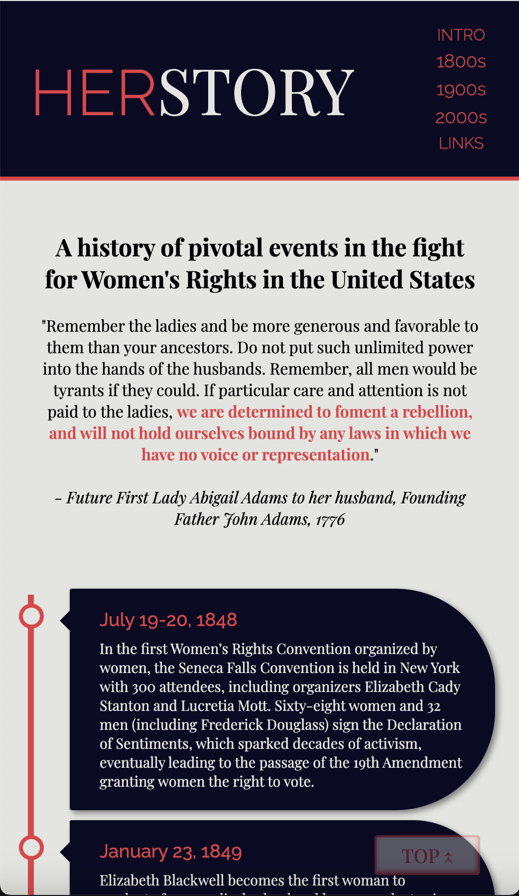

# Herstory Tribute
A tribute page highlighting pivotal moments for Women's Rights in US history

## Description
This page is created using HTML and CSS. CSS psuedo elements are used to add pointers along the timeline, and the timeline ruler itself. Challenges came up in positioning these elements in the expanded view of the page.

## Built With
    * HTML
    * CSS
    * Google Fonts API

## Link to the Project:
https://christinabohn.github.io/herstory-tribute/

## Preview

## Thank You
For taking the time to check out my page!